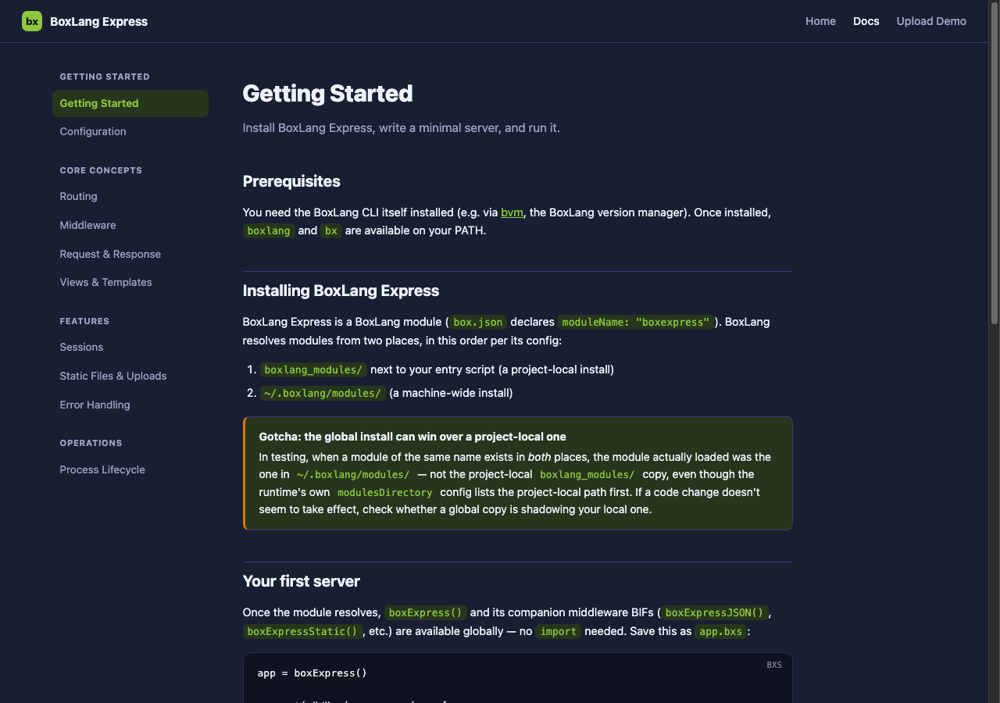
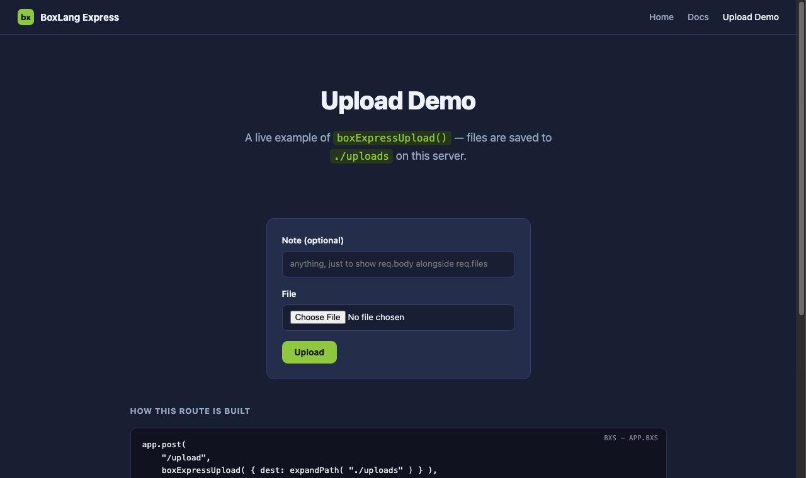
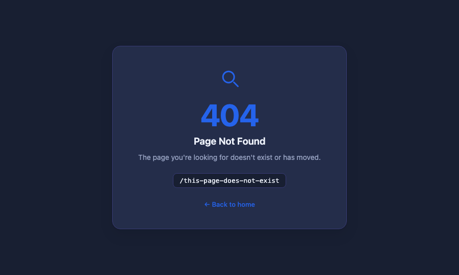
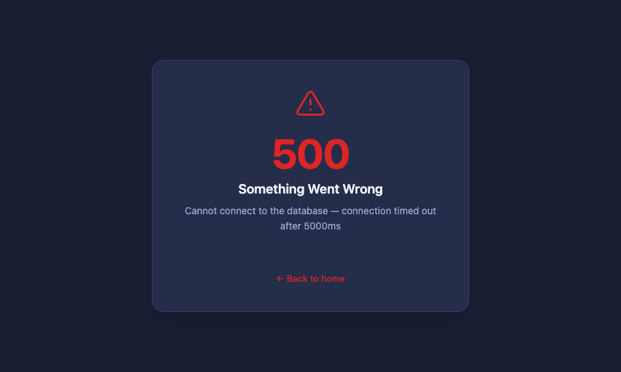

# BoxLang Express Demo

A working example app built on [BoxLang Express](https://github.com/ortus-boxlang/boxlang-express) — an Express.js-style API for building lightweight HTTP servers in [BoxLang](https://boxlang.io). This app doubles as BoxLang Express's own documentation site: every page you can read about, you can also click through and try live.

## Prerequisites

- The [BoxLang](https://boxlang.io) CLI (`boxlang`/`bx` on your PATH) — install via [bvm](https://bx.dev), the BoxLang version manager.
- BoxLang Express itself, available as a BoxLang module. See [Getting Started](http://localhost:3003/docs/getting-started) (once running) for how module resolution works and where to install it from.

## Running

```bash
boxlang app.bxs
```

The server listens on **port 3003**. `app.listen()` blocks the process — stop it with `Ctrl-C`.

Dev-mode auto-reload is on (`app.set("reloadOnChange", true)`), so editing any `.bx`/`.bxs`/`.bxm` file under this directory restarts the server automatically and picks up the change.

## Screenshots

<table>
<tr>
<td width="50%">

**Documentation** — sidebar nav, code blocks, callouts


</td>
<td width="50%">

**Upload Demo** — a live `boxExpressUpload()` example


</td>
</tr>
<tr>
<td width="50%">

**404** — themed, not the framework's default JSON


</td>
<td width="50%">

**500** — shown here in development mode, with the real error message


</td>
</tr>
</table>

## What's here

| Route | What it is |
|---|---|
| `/` | Home page — quickstart snippet, feature overview, links into the docs |
| `/docs/*` | Full BoxLang Express documentation — getting started, configuration, routing, middleware, request/response, views, sessions, static files & uploads, error handling, process lifecycle |
| `/upload` | Live `boxExpressUpload()` demo — uploads a file to `./uploads` and shows what was received |
| Any unmatched path | A themed 404 page |
| Any unhandled error | A themed 500 page (shows the real error message in dev mode) |

## Project structure

```
app.bxs              Entry point — routes, middleware, and server startup
views/
  home.bxm           Home page
  upload.bxm         Upload demo (form + result, same view for both)
  error.bxm          Shared 404/500 template
  docs/              One .bxm per documentation page
  partials/          Shared <head>/<nav>/<sidebar>/<foot> included by every page
public/
  assets/css/        Site stylesheet
  assets/img/        Screenshots used in the docs
uploads/             Where the upload demo saves files (gitignored, kept via .gitkeep)
```

## Notes

- No config file is required to run this app — it has no datasource or other config-dependent features. See the [Configuration](http://localhost:3003/docs/config) doc page if you want to add one (`--bx-config`, environment variable interpolation, etc.) — it's written generally, not tied to a file in this project.
- The whole site — theme, error pages, everything — is self-contained in this project. Nothing here modifies the BoxLang Express framework itself.
